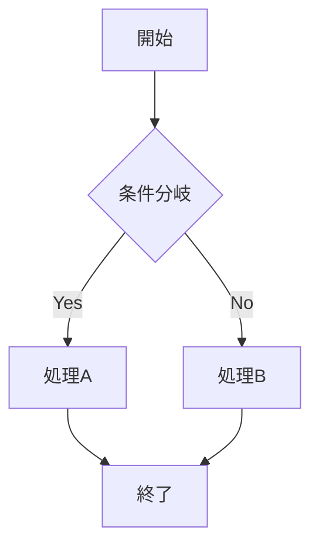
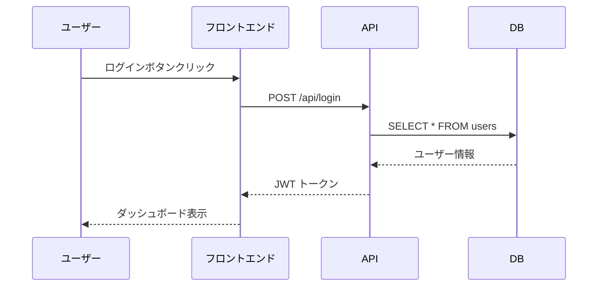
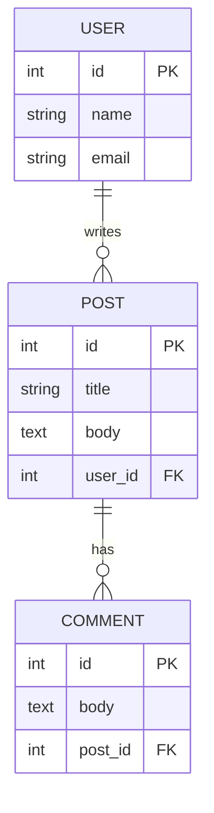
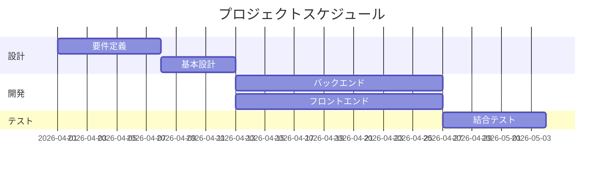
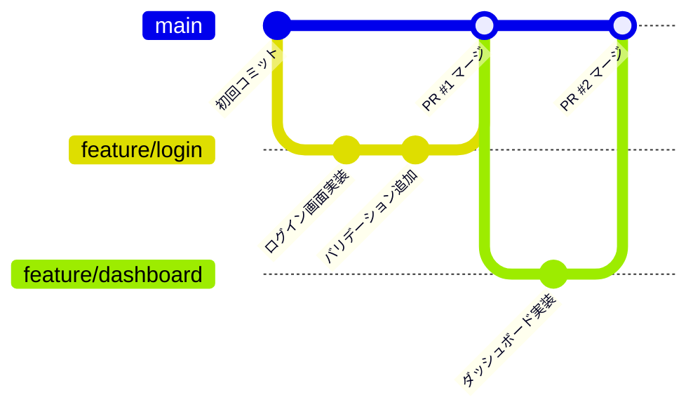
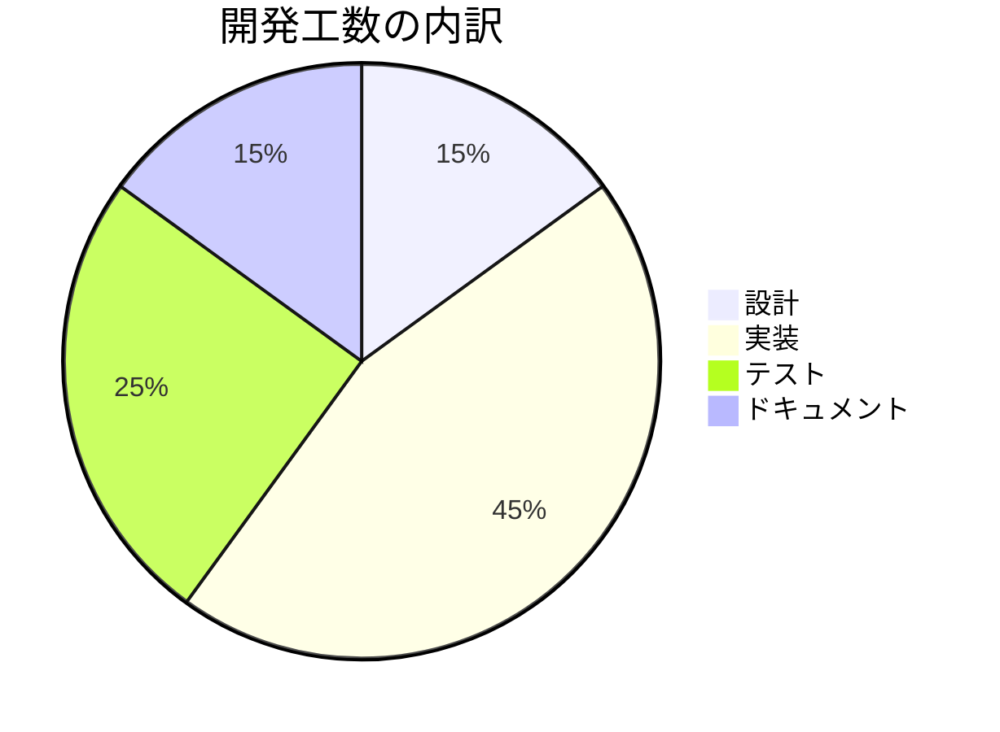

# MarkDown-Sample

https://qiita.com/teppei19980914/items/36404f9ec9c786cde671?utm_campaign=daily_trend&utm_medium=web_push_notification&utm_source=qiita

# H1 — 記事タイトル（1記事に1つだけ）
## H2 — 大セクション
### H3 — サブセクション
#### H4 — 補足説明


**太字** は重要な箇所に。  
*斜体* は英語の固有名詞や強調に。  
~~打ち消し線~~ は訂正に。  
`インラインコード` は関数名や変数名に。  


- 箇条書き1
- 箇条書き2
  - ネスト可能

1. 番号付き1
2. 番号付き2

- [ ] 未完了タスク
- [x] 完了タスク


| 項目 | Markdown | HTML | Word |
|:---:|---|:---|---:|
| バージョン管理 | ◎ テキストなので diff が明確 | △ タグが冗長 | × バイナリ |
| 表示速度 | ◎ 軽量 | ○ ブラウザ依存 | △ アプリ起動必要 |
| 共同編集 | ◎ Git で管理 | ○ 可能 | △ 競合しやすい |


```python
def hello():
    print("Hello, Markdown!")
```

```diff_python
- def old_function():
-     return None
+ def new_function():
+     return "improved"
```

1日1%の成長を365日続けると $1.01^{365} \fallingdotseq 37.8$ 倍になります。


```math
\sum_{i=1}^{n} a_i = a_1 + a_2 + \cdots + a_n
```
















:::note info
💡 補足情報をここに書きます。
:::

:::note warn
⚠️ 注意事項をここに書きます。
:::

:::note alert
🚨 重要な警告をここに書きます。
:::

<details><summary>クリックで展開</summary>

長いログやコードなど、デフォルトで隠しておきたい内容を入れます。

```python
# 長いコード例
for i in range(100):
    print(f"Line {i}")
```

</details>

Markdown は John Gruber によって作られました[^1]。
Mermaid は Knut Sveidqvist によって開発されています[^2]。

[^1]: 2004年に最初のバージョンが公開
[^2]: JavaScript ベースの OSS プロジェクト


